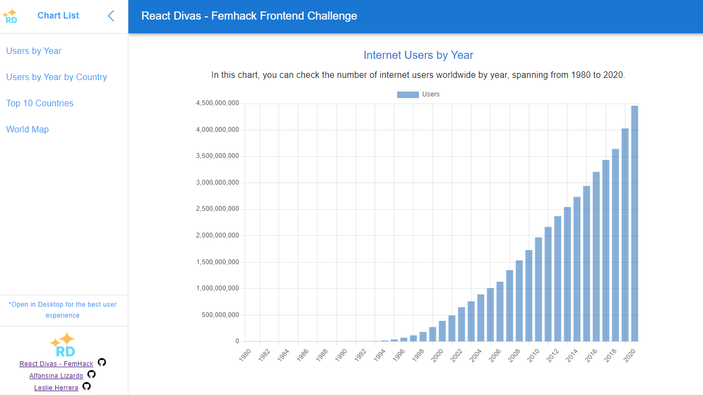
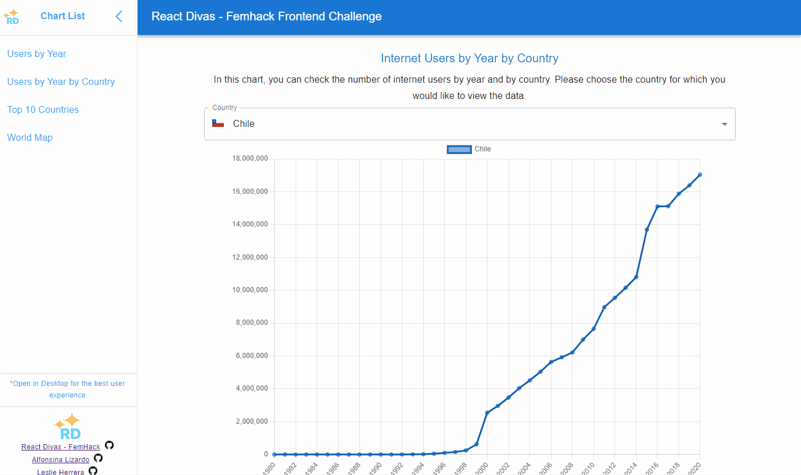

# FemHack FrontEnd Challenge 
<h2>React Divas Team✨</h2> 


> Challenge from Frontend femhack challenge by nuwe June 2023

Technologies used 👇:

<span>

 </span>
<span> 
<span> 

</span>
<span>

</span>
<span>

</span>
<span>

</span>
 <span>

 </span>
 <span>

 </span>
  <span>

 </span>
  <span>

 </span>
 <span> 

</span>
<span>

 </span>

 ## More about this project


 ### Users x Year Chart



### Users x Year x Country Chart


### Top 10 countries from 1980 - 2020



### World Map - top 10 countries 2020


 

## Prerequisites
Make sure you have the following software installed on your machine:

- Node.js (version 14 or above)
- npm (version 7 or above)

## Installation

1. Clone the repository.
2. Navigate to the project directory
```
cd femhack-frontend-challenge
```
2. Install dependencies using `npm install`.
```
npm install
```
3. Create a .env file and add the following information
```
API_URL=backend API URL
```

## Usage

- To start the development server, run `npm run dev`.
- To build the production-ready code, run `npm run build`.
- To preview the production build, run `npm run preview`.

## Linting and Formatting

- To run ESLint and check for code errors, run `npm run lint`.
- To automatically fix ESLint errors, run `npm run lint:fix`.
- To format code using Prettier, run `npm run format`.
- To check for stylelint errors in stylesheets, run `npm run lint:styles`.
- To automatically fix stylelint errors in stylesheets, run `npm run fix:styles`.

## Why  React ...👀? Why ... ?

- We decided to use `React`, `Vite` & `Axios` because they are the libraries we have the most experience with. Similarly, our choice of `MUI` was based on our familiarity with it. While we may not be experts in MUI, we have used it in some past projects, and it allows us to create acceptable layouts for the user.

- When it came to choosing a chart library, we conducted an internet search for popular options in React. We ultimately decided to go with `Charts.js` in its React version. Although it may not have the highest number of stars compared to libraries like Recharts, we believe that for the femhack project's MVP, Charts.js is more precise and straightforward. We considered Recharts to be better suited for more complex charting needs, and we also found Charts.js to have a more user-friendly UI.

- For the decision regarding the chart that required a world map, we were interested in several libraries. The one that caught our attention the most was `react-globe`. However, it required knowledge of `three.js`, and we were unable to render the chart as expected. We extensively searched the internet and tried various iterations, but many libraries were either paid or similar to Google Maps. After much searching, we came across the library `React-SVG-World-Map`, which is quite simple and allowed us, given the time constraints of the project, to display the top countries of the year 2020.

## Workflow

The following techniques were used for project management: `pair-programming` and `code-review` for each Pull Request made.

`Gitflow` was employed for commit management, primarily utilizing the /feature/{number-of-issue} folder structure for creating different branches.

The refinement methodology was initially used to analyze the work that needed to be done. All cards with issues were created on a `Kanban board` [Link to kanban](https://github.com/users/Alais29/projects/2/views/1), with added links or descriptions as necessary.

The `Projects` [Link to Projects](https://github.com/users/Alais29/projects/2/views/1?pane=info) section of Github was utilized to keep a direct record of the work done in the repository. It allowed for linking issues and PRs, which could be moved to "done" once the branch was merged.


## Folders Sctructure

- We have decided to use a simple folder structure, where inside src we will have `/assets`, where useful images can be found that may be shared between components. Then we have the /components folder, which contains `/charts`, `/common`, and `/layout`. The first folder has various chart components, common has reusable and shared components, and finally /layout contains components that only contain others.

- The folder `/hooks`: we added more information with comments inside each hook but mainly these components bring reusable data and also include an animation that allows a chart to display data every 0.5 seconds and update dynamically.

- Inside `/services` folder, you will find different backend ([Link to backend](https://github.com/nuwe-reports/femhack-II-frontend-challenge)) calls, and the `Axios` library is used.

- Subsequently, we have the `/test` folder, where component tests are located, made with Vitest.

- Finally, we have the `/utils` folder, where you can find reusable functions or information to consume in JSONC format.

```
📦src
 ┣ 📂assets
 ┃ ┣ 📜chevronLeft.svg
 ┃ ┣ 📜..
 ┣ 📂components
 ┃ ┣ 📂charts
 ┃ ┃ ┣ 📜TopCountries.jsx
 ┃ ┃ ┣ 📜UsersYear.jsx
 ┃ ┃ ┣ 📜..
 ┃ ┣ 📂common
 ┃ ┃ ┗ 📜CustomSelect.jsx
 ┃ ┃ ┗ 📜...
 ┃ ┗ 📂layout
 ┃ ┃ ┗ 📜PersistentDrawerLeft.jsx
 ┣ 📂hooks
 ┃ ┣ 📜useAnimation.jsx
 ┃ ┣ 📜useContryDataByYear.jsx
 ┃ ┣ 📜..
 ┣ 📂services
 ┃ ┣ 📜baseUrl.js
 ┃ ┣ 📜getCountries.js
 ┃ ┣ ..
 ┣ 📂test
 ┃ ┣ 📜App.test.jsx
 ┃ ┣ 📜setupTest.js
 ┃ ┣ 📜..
 ┣ 📂utils
 ┃ ┣ 📜countryCodes.js
 ┃ ┣ 📜getCountriesWithCode.js
 ┃ ┗ ..
 ┣ 📜App.css
 ┣ 📜App.jsx
 ┗ 📜main.jsx
```

## Testing

We decided to use Vitest along with react-testing-library to perform some unit tests. Mainly, we were able to conduct tests to determine if the components are being rendered and also if the loading functionality is working.
In the future, we hope to be able to add tests to verify the different functions, especially the data fetching.


## Dependencies

- [react](https://www.npmjs.com/package/react): ^18.2.0
- [react-dom](https://www.npmjs.com/package/react-dom): ^18.2.0
- [@emotion/react](https://www.npmjs.com/package/@emotion/react): ^11.11.1
- [@emotion/styled](https://www.npmjs.com/package/@emotion/styled): ^11.11.0
- [@mui/material](https://www.npmjs.com/package/@mui/material): ^5.13.6
- [axios](https://www.npmjs.com/package/axios): ^1.4.0
- [chart.js](https://www.npmjs.com/package/chart.js): ^4.3.0
- [react-chartjs-2](https://www.npmjs.com/package/react-chartjs-2): ^5.2.0
- [react-svg-worldmap](https://www.npmjs.com/package/react-svg-worldmap): ^2.0.0-alpha.16

## Development Dependencies

- [@testing-library/jest-dom](https://www.npmjs.com/package/@testing-library/jest-dom): ^5.16.5
- [@testing-library/react](https://www.npmjs.com/package/@testing-library/react): ^14.0.0
- [@types/react](https://www.npmjs.com/package/@types/react): ^18.0.37
- [@types/react-dom](https://www.npmjs.com/package/@types/react-dom): ^18.0.11
- [@vitejs/plugin-react](https://www.npmjs.com/package/@vitejs/plugin-react): ^4.0.0
- [eslint](https://www.npmjs.com/package/eslint): ^8.38.0
- [eslint-config-prettier](https://www.npmjs.com/package/eslint-config-prettier): ^8.8.0
- [eslint-plugin-prettier](https://www.npmjs.com/package/eslint-plugin-prettier): ^4.2.1
- [eslint-plugin-react](https://www.npmjs.com/package/eslint-plugin-react): ^7.32.2
- [eslint-plugin-react-hooks](https://www.npmjs.com/package/eslint-plugin-react-hooks): ^4.6.0
- [eslint-plugin-react-refresh](https://www.npmjs.com/package/eslint-plugin-react-refresh): ^0.3.4
- [jsdom](https://www.npmjs.com/package/jsdom): ^22.1.0
- [prettier](https://www.npmjs.com/package/prettier): ^2.8.8
- [stylelint](https://www.npmjs.com/package/stylelint): ^15.9.0
- [stylelint-config-standard-scss](https://www.npmjs.com/package/stylelint-config-standard-scss): ^10.0.0
- [vite](https://www.npmjs.com/package/vite): ^4.3.9
- [vitest](https://www.npmjs.com/package/vitest): ^0.32.2


## What we have learn and what is next ... 👩‍💻

In this project, we learned a lot. Our experience with chart libraries was almost non-existent, but we managed to display the information successfully.

There were some issues with the incoming data. For example, some countries didn't have information for all years, and sometimes the years were missing altogether. We had to manipulate the data to ensure that the charts didn't break.

We had no prior experience with `Docker`, but we were able to set up and use the backend within containers. This gave us a better understanding of Docker's capabilities, and we believe it's a great tool for our workflow.

We achieved  `100% SEO and accessibility` in the `Lighthouse` report. In the future, we hope to improve the performance metric to implement further enhancements.


We were able to perform some basic tests on our application. We plan to add more tests that cover things like headings and even UI elements.

Responsive design: We made an effort to ensure that the charts display well on smaller screens, but there is still work to be done in this area.

Regarding styling, we believe there is room for improvement in both the `UI and UX` of the application. We have taken care to include appropriate alt and title attributes, as well as meta descriptions, titles, and subtitles for different sections. However, the overall user experience could be enhanced further.

## Authors
- 👤 **Alfonsina Lizardo** Github: [@Alais29](https://github.com/Alais29)
- 👤 **Leslie Herrera** Github: [@Dereemii](https://github.com/Dereemii)
